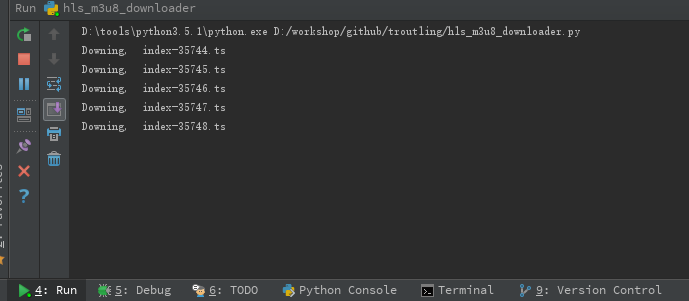

# 第一次尝试pr
# HLS_m3u8_downloader
### prerequisite

python3

### library

```
pip3 install m3u8
pip3 install cryptography
pip3 install requests
```

### m3u8 sample

```
#EXTM3U
#EXT-X-VERSION:3
#EXT-X-ALLOW-CACHE:YES
#EXT-X-MEDIA-SEQUENCE:35739
#EXT-X-TARGETDURATION:20
#EXTINF:19.992, no desc
index-35739.ts
#EXTINF:19.981, no desc
index-35740.ts
#EXTINF:19.992, no desc
index-35741.ts
#EXTINF:19.981, no desc
index-35742.ts
```

### tested server 

<https://github.com/ossrs/srs>

### screenshot



### todo

* variant bandwidth

* ...

  ​
